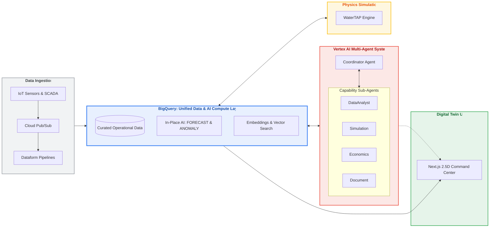
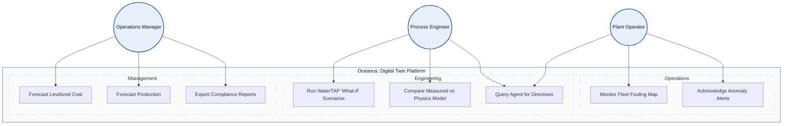

# 💧 RO Digital Twin — Water Infrastructure

> **A cloud-native digital twin for Municipal/Industrial Brackish Water Reverse Osmosis (BWRO) facilities** — unifying operational data, physics-based simulation, AI diagnostics, and economics into a single GCP-native platform.

## 🎥 What is Reverse Osmosis?

> *Click the thumbnail above to watch a primer on how Reverse Osmosis works — a great starting point before diving into the codebase.*
---

## What is RO water?

**RO (Reverse Osmosis)** is a water-cleaning process.

- Water is pushed through a very fine membrane (a special filter).
- The membrane blocks most salts and impurities.
- Cleaner water passes through; concentrated waste (brine) is separated out.

For **brackish water** (water that is saltier than freshwater but less salty than seawater), RO is one of the most common ways to produce usable water for communities and industry.

---

## Why this project exists

RO plants generate lots of data every day, but it can be hard to quickly answer practical questions like:

- Is the plant running normally?
- Is membrane fouling getting worse?
- Why did energy use increase this week?
- What changed after a cleaning event (CIP)?
- What is the cost impact of a process change?

This digital twin combines plant data, physics-based simulation, and AI analysis to support those decisions.

---

## What is a “digital twin”?

A **digital twin** is a software model of a real system.

For this project, the twin mirrors an RO facility by combining:

1. **Operational data** (what happened in the plant)
2. **Physics models** (what should happen based on process behavior)
3. **AI diagnostics** (what looks unusual and why)
4. **Economic calculations** (what changes mean for cost)

The goal is decision support — **not automatic control of equipment**.

## 🔄 System Architecture & Data Flow

## 👥 Use Cases & Personas

## 🗂️ Where to Start

| Doc | What it covers |
|---|---|
| [`docs/00-overview.md`](docs/00-overview.md) | Full architecture, system diagram, key decisions |
| [`docs/01-problem-domain.md`](docs/01-problem-domain.md) | Pain points, economics, use cases |
| [`docs/07-implementation-plan.md`](docs/07-implementation-plan.md) | Phased build plan |
| [`docs/03-physics-engine.md`](docs/03-physics-engine.md) | WaterTAP integration & spike results |
| [`docs/04-ai-agent.md`](docs/04-ai-agent.md) | ADK agent, Memory Bank, RAG, tools |
| [`AGENTS.md`](AGENTS.md) | Agent coding conventions & gotchas |
| [`spike_watertap.py`](spike_watertap.py) | Only runnable code today — WaterTAP validation spike |

> **Current status:** Planning complete. Architecture designed. Only the WaterTAP spike is runnable — the rest lives as design briefs in `docs/`. Read the docs as source of truth.
