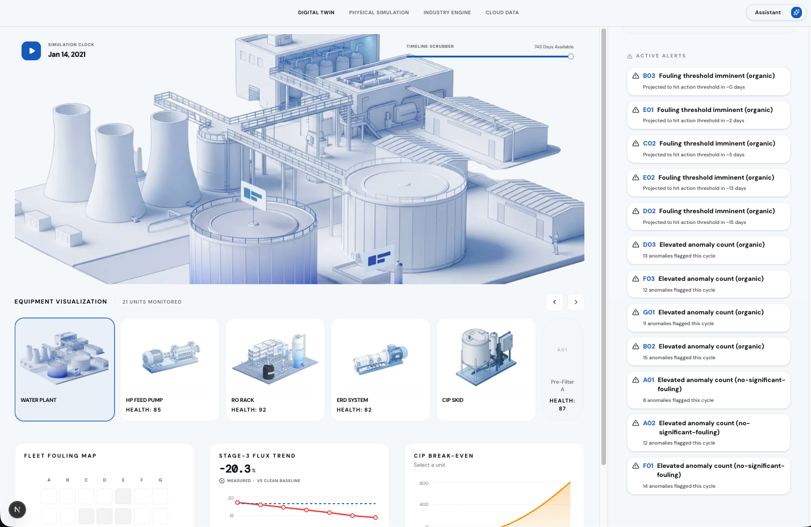
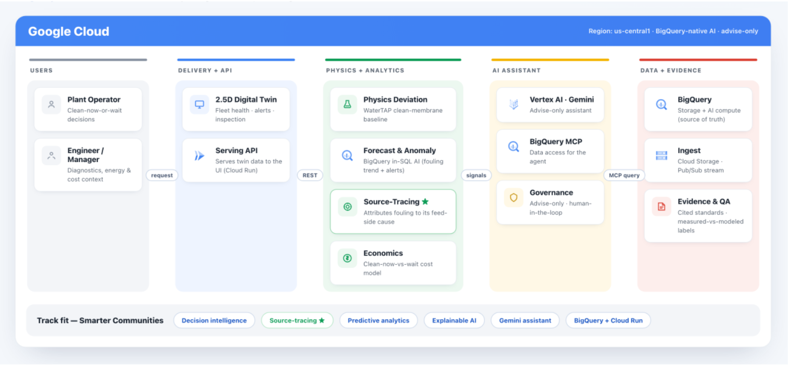
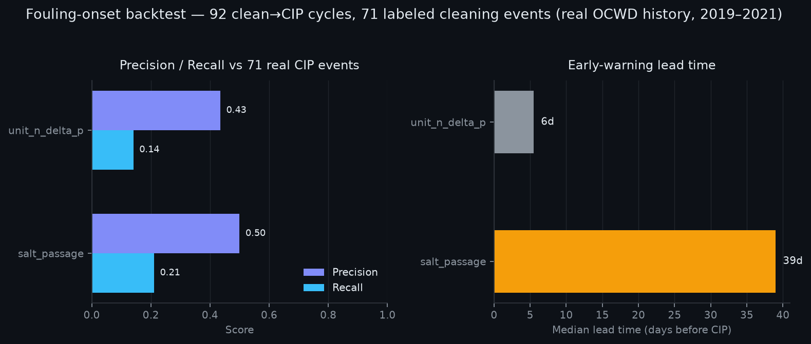
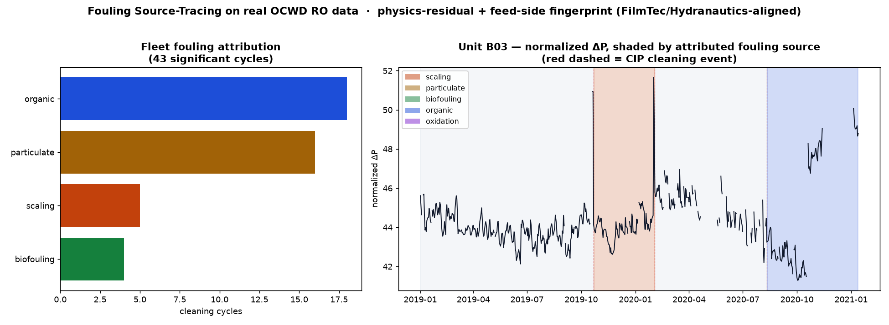

# Oceanus Water Treatment Plant Digital Twin

Oceanus Lab builds an AI-powered digital twin for water infrastructure, fusing physics-based RO models with trustworthy agents to diagnose, forecast, and optimize municipal and industrial treatment systems for resilient, climate-aware operations.




**Live demo:** [ro-frontend-903682941870.us-central1.run.app](https://ro-frontend-903682941870.us-central1.run.app) (Backend Under Maintenance)

---

## What it does

Reverse osmosis plant runs 21 membrane units around the clock. Three people need different answers from the same data:

| Persona | Screen | Question |
|---|---|---|
| Plant Operator | Digital Twin (2.5D fleet view) | "Which unit is degrading right now, and what do I do?" |
| Process Engineer | Physical Simulation | "Run a WaterTAP what-if — how does bank A compare to bank G?" |
| Operations Manager | Industry Engine | "What's the LCOW trend, and what's the maintenance budget look like?" |

An AI assistant sits across all three, answering plain-language questions by calling the same tools a human would use.

The dataset is real: 21 membrane units (7 banks × 3 stages) from the Orange County Water District, daily readings from 2019-01-01 to 2021-01-13, with 71 labeled cleaning (CIP) events.

---

## Architecture



**The architecture bet:** BigQuery is both the storage layer *and* the primary AI compute layer. Forecasting, anomaly detection, embeddings, and NL summarization all run in-SQL — `AI.FORECAST`, `AI.DETECT_ANOMALIES`, `AI.GENERATE`, `VECTOR_SEARCH`. The Gemini Agent Platform is reserved for agent orchestration only. Fewer moving parts, lower latency, lower cost — and it means a fouling forecast and an anomaly score come from the same warehouse that stores the reading, not a separate ML pipeline that can drift out of sync with it.

---

## Eval results

The fouling early-warning model is backtested against all 71 real cleaning events in the dataset — not a held-out synthetic set, the actual history.



| Metric | salt_passage (primary) | unit_n_delta_p (alternative) |
|---|---|---|
| Precision | 0.50 | 0.43 |
| Recall | 0.21 | 0.14 |
| Median lead time | 39 days | 5.5 days |
| True / false positives | 15 / 15 | 10 / 13 |

Read plainly: the salt-passage signal catches about 1 in 5 real cleaning events, but when it fires, it's right half the time and it fires over a month before the clean — enough runway to actually plan around. It is an early-warning signal, not a certain one, and the chart says that instead of a claim.



Fleet-wide, organic and particulate fouling dominate the 43 significant cycles; Unit B03's ΔP trace above shows the attributed source shifting cycle to cycle, cleaned each time by a real CIP event.

The AI assistant itself is evaluated against a 10-case golden Q&A set (`specs/007-ai-assistant/eval/golden_qa.json`) covering diagnosis, simulation, economics, and document-grounded questions, plus a latency check script (`specs/007-ai-assistant/eval/latency_check.sh`).

---

## Tech stack

| Layer | Choice | Why |
|---|---|---|
| Data + AI compute | BigQuery | Data lake, warehouse, and primary AI compute — one place, not three |
| AI functions | BigQuery ML | Forecast, anomaly, and RAG run in-SQL, no separate ML pipeline |
| Agent runtime | Vertex AI | Enterprise runtime for the agent — orchestration only, not compute |
| LLM | Gemini Flash + Gemini Pro | Flash for routine calls; Pro only where reasoning depth earns its cost |
| Compute | Cloud Run | Serverless, scale-to-zero hosting for frontend, serving API, and physics engine |
| Streaming | Cloud Pub/Sub | Replay telemetry through the same path a live SCADA feed would use |
| Ingest | Cloud Storage | Batch landing zone for the raw plant history |
| Transforms | Dataform | Versioned, tested SQL — raw to curated, reproducibly |
| Observability | Cloud Trace | See what the agent actually did, not just what it answered |
| Agent framework | ADK 2.0 | Coordinator routes to DataAnalyst, Simulation, Economics, Document |
| Tool transport | MCP (BigQuery MCP Server) | Standard, secure transport between agent tools and data |
| Agent memory | Vector Search + RAG (BigQuery embeddings, semantic cache) | Cached answers — repeat questions are cheap |
| Physics engine | WaterTAP 1.6.0 | Deterministic BWRO baseline, not a black-box guess |
| Physics API | FastAPI | Exposes the physics engine to Cloud Run |
| Solver | Pyomo + Ipopt | Modeling language and non-linear solver underneath WaterTAP |
| Frontend | Next.js + React | 2.5D visual command center, one codebase, one deploy |

---

## Data source

**Primary dataset**

| Dataset | Source | Contents | Format |
|---|---|---|---|
| OCWD RO Fouling | [Harvard Dataverse DOI:10.7910/DVN/PVY3QD](https://dataverse.harvard.edu/dataset.xhtml?persistentId=doi:10.7910/DVN/PVY3QD) | 21 units, 7 banks × 3 stages, daily 2019-01-01–2021-01-13, 15,624 rows, 128/117-col schemas, 71 labeled CIP events | 21 CSVs |

**Enrichment joins**

| Dataset | Purpose | Source |
|---|---|---|
| EIA Electricity Prices | $/kWh by state/month — converts SEC to energy cost, drives LCOW | [EIA API v2](https://www.eia.gov/opendata/) |
| WaterTAP Costing Module | LCOW, SEC baseline, CAPEX/OPEX | Built into WaterTAP package |
| Open-Meteo | Forward feed-temp / ambient for forecast scenarios (historical temp already in OCWD `temp_c`) | [open-meteo.com](https://open-meteo.com/en/docs/historical-weather-api) |
| EIA generation mix | CO₂/m³ ESG metric — SEC × grid emission factor | [EIA API v2](https://www.eia.gov/opendata/) |
| NAWI Water-DAMS | BWRO SEC/LCOW benchmarks for validation | [Water-DAMS](https://www.nawihub.org/?page_id=669) |
| Historical Replay Harness | Clock-driven replay of the real OCWD history through Pub/Sub — the data thread every other component reads from | OCWD CSVs + Pub/Sub |

---

## Repository structure

```
services/
  agent/            ADK 2.0 multi-agent — Coordinator + DataAnalyst / Simulation / Economics / Document
  source-tracing/   Physics deviation, forecast, fouling validation, economics, assistant briefings
  serving-api/      FastAPI bridge — serves source-tracing output to the frontend
  replay/           Clock-driven harness streaming the real OCWD history through Pub/Sub
  frontend/         Next.js 2.5D digital twin UI
pipeline/
  ingest/           BigQuery loaders (OCWD, EIA, weather)
  dataform/         Versioned SQL transforms — raw to curated
infra/
  terraform/        GCP foundation — BigQuery datasets, Pub/Sub, IAM, budget alert
  scripts/          bootstrap.sh, deploy_service.sh (the one Cloud Run deploy path)
research/           Reproducible chart scripts behind this README's eval and HCAI figures
docs/               Numbered design briefs — architecture, data pipeline, physics, AI agent
specs/              Per-feature spec-kit docs (001–011): spec, plan, tasks, quickstart
```

---

## Quick start

```bash
# Frontend, local dev (mock data if no serving API is reachable)
cd services/frontend && npm install && npm run dev

# Backend prototype (physics deviation → forecast → fouling validation → economics → assistant)
cd services/source-tracing && ../../.venv-watertap-spike/bin/python run_all.py
```

---
